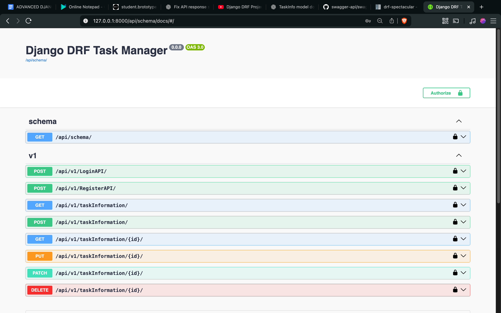

# 🚀 TaskManager: Full-Stack Task Management System

Built with **Django** and **Django REST Framework**, TaskManager is a production-ready task management solution deployed on **AWS** and **Heroku**. Key highlights:

- **User Authentication & Authorization**: Secure registration, login, and token-based API authentication.
- **CRUD Operations for Tasks**: Create, read, update, delete tasks with automatic user association.
- **RESTful API with Documentation**: Swagger UI for documentation, tested in production using Postman.
- **Pagination & Filtering**: Efficient handling of large task datasets.
- **Modular & Scalable Architecture**: Clear separation of web, API, and authentication layers.

This project demonstrates best practices in **API design**, **secure authentication**, **production-level testing**, and **cloud deployment**, making it robust and developer-friendly.
